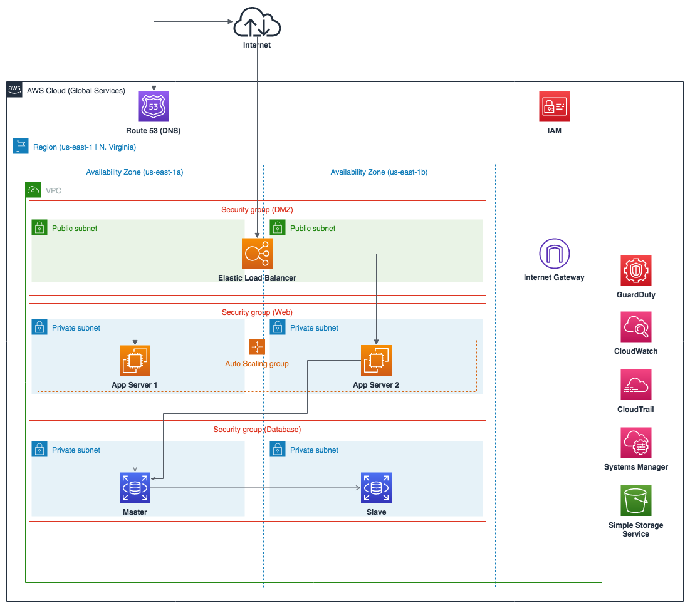

------

#### Templates Overview

To make the setup re-useable and easy to manage, CloudFormation and nested stacks have been created.

The Templates are a logical grouping of services.

**master.yaml**

Placeholder for all parameters, definition and link to children templates

**01-newvpc.yaml**

Creates a new VPC with 6 subnets spread across 2 Avaliablity Zones (The bash script will only take the 'a' and 'b' zones no matter which region you choose.

To allow for flow of traffic across subnets, it also creates the route tables (Seperate for each layer of the stack [Public/Web/Data] )

NATGW is are spun up with route setup to allow for instances in the private subnet 0.0.0.0/0 out access

IGWs are also associated with the VPC

Flowlogs are enabled and IAM Roles associated to the VPC service to allow the logs to be sent to CloudWatch 

**02-securitygroups.yaml**

Creates the groups for each layer of the stack and nests the groups top to bottom

Public has 80 open to 0.0.0.0/0, Web is only open to Public over 80, and Data is only open to Web over 3306

**03-publicalb.yaml**

Creates a Application loadbalancer and its listerner groups.

**03-rds.yaml**

Creates an RDS Aroura Cluster with 2 nodes, 1 writer and 1 reader

**04-web.yaml**

Creates an AutoScaling Group and Lauch Configurations. It would spin up 2 Instances and associated them to the Listener group of the Application LoadBalancer.

The LaunchConfigurations would also hold the dependency packages definations that would be installed on the instance when it launched using Cloudformation::Init. The Instance creation would only be marked successfull if the cfn-signal helper send out the status code back to the CloudFormation Service.

**05-dashboard.yaml**

Creates a dashboard with a few metrices about the LoadBalancer and RDS within CloudWatch.

(*) Scope limits mentioned at the end

------

#### How to Deploy

```bash
./deployer.sh <bucket-name> <stack-name> [aws-default-profile] [aws-region]
```

**bucket-name** - AWS Bucket where the templates would be uploaded (Standard S3 Bucket naming rules apply).

**stack-name** name for the cloudformation stack.

**aws-default-profile** (optional) - The CLI profile to be chosen when doing deployments. If nothing is entered, the default profile is chosen

**aws-region** (optional) - The region where the deployment would be made (Expected input. The AWS Region codes eg "us-east-1" region map below, if nothing is entered default region would be us-east-1)

| Region Name (Human Readable) | Region Code |
| ---------------------------- | ----------- |
|US East (Ohio)| us-east-2|
|US East (N. Virginia)|us-east-1|
|US West (N. California)|	us-west-1|
|US West (Oregon)|	us-west-2|
|Asia Pacific (Mumbai)|	ap-south-1|
|Asia Pacific (Seoul)|	ap-northeast-2|
|Asia Pacific (Singapore)|	ap-southeast-1|
|Asia Pacific (Sydney)|	ap-southeast-2|
|Asia Pacific (Tokyo)|	ap-northeast-1|
|Canada (Central)|	ca-central-1|
|EU (Frankfurt)|	eu-central-1|
|EU (Ireland)|	eu-west-1|
|EU (London)|	eu-west-2|
|EU (Paris)|	eu-west-3|
|EU (Stockholm)|	eu-north-1|
|South America (São Paulo)|	sa-east-1|

------

#### Wanted to implement

- Validations in the ```./deployer.sh``` bash script (for bucket name/region check)
- Route53 for custom DNS implementations.
- SSM Instance Association (SSH access using IAM from the AWS Console)
- Store RDS URI/Username in SSM Parameter store and Password as Secure String (Encrypted Strings using KMS)
- RDS Access to code on EC2 via IAM Roles
- Enabling CloudTrail + GuardDuty
